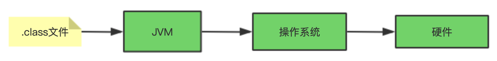
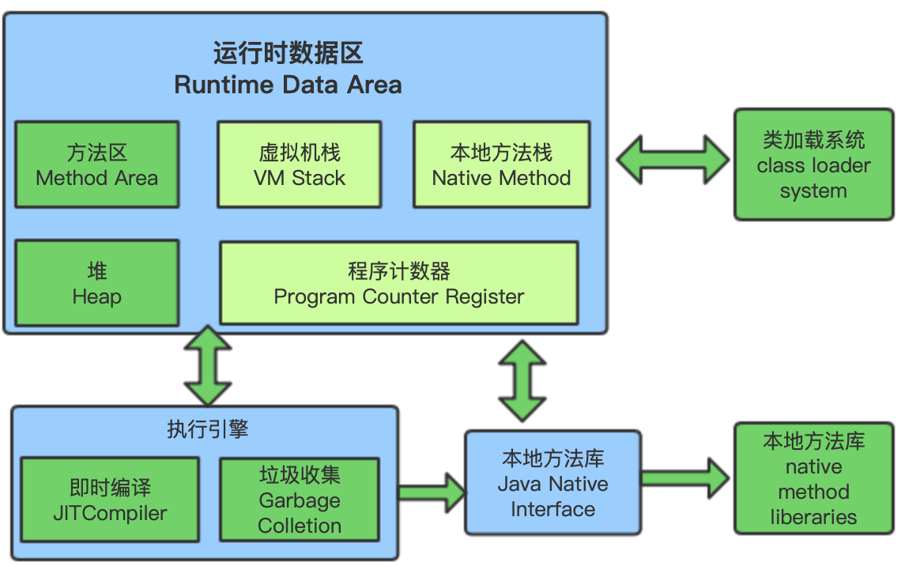
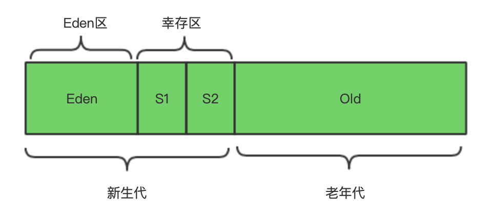

## JVM 简介

​    JVM 是Java Virtual Machine的缩写。它是运行在操作系统之上的Java运行环境。它的目的是屏蔽操作系统之间API的差别，实现java语言可以跨平台运行， 所以针对各种操作系统都有对应的jdk实现版本。




## 一、JVM 内存模型以及分区



  JVM 运行时数据区分为方法区、堆、虚拟机栈、本地方法栈、程序计数器。其中虚拟机栈、本地方法栈、程序计数器是线程私有的， 而方法区、堆是线程共享的，垃圾回收常常发生在堆中。

### 1. 程序计数器

程序计数器是一块较小的内存空间， 可以看作是当前线程所执行字节码的行号批示器。字节码解释器工作时通过改变这个计数器的值来选取下一条指令，分支、循环、跳转、异常处理、线程恢复等都要依赖这个计数器来完成。

### 2. Java虚拟机栈

- **虚拟机栈**是线程私有的，它的生命周期跟线程相同(随线程而生，随线程而灭)。

- 如果线程请求的栈深度大于虚拟机允许的最大深度， 将会抛出**StackOverflowError**；如果虚拟机栈可以动态扩展，扩展时无法申请到足够内存，则会抛出**OutOfMemoryError**。

- Java虚拟机栈描述的是Java方法执行的内存模型，每个方法的调用会创建一个**栈桢**。（实际上，Java 虚拟机栈是由一个个栈帧组成，而每个栈帧中都拥有：局部变量表、操作数栈、动态链接、方法出口信息。）

  **局部变量表主要存放了编译期可知的各种数据类型**（boolean、byte、char、short、int、float、long、double）、**对象引用**（reference 类型，它不同于对象本身，可能是一个指向对象起始地址的引用指针，也可能是指向一个代表对象的句柄或其他与此对象相关的位置）。

### 3. 本地方法栈

它和虚拟机栈作用非常类似， Java虚拟机栈是为执行Java方法服务，本地方法栈是为执行native方法服务。它随地本方法调用而创建，本地方法返回而回收。

### 4. 堆

**堆**是线程共享的， 主要用来存放对象实例，数组，是进行垃圾回收主要区域。因些也叫**GC堆**

**Java世界中“几乎”所有的对象都在堆中分配，但是，随着JIT编译期的发展与逃逸分析技术逐渐成熟，栈上分配、标量替换优化技术将会导致一些微妙的变化，所有的对象都分配到堆上也渐渐变得不那么“绝对”了。从jdk 1.7开始已经默认开启逃逸分析，如果某些方法中的对象引用没有被返回或者未被外面使用（也就是未逃逸出去），那么对象可以直接在栈上分配内存。**

堆可以分为新生代，老年代，默认比例为1:2；  **–XX:NewRatio**

新生代又分为Eden区， S1， S2区,  其默认比例是8:1:1。**–XX:SurvivorRatio**




### 5. 方法区

方法区与 Java 堆一样，是各个线程共享的内存区域，它用于存储已被虚拟机加载的类信息、常量、静态变量、即时编译器编译后的代码等数据。虽然 **Java 虚拟机规范把方法区描述为堆的一个逻辑部分**，但是它却有一个别名叫做 **Non-Heap（非堆）**，目的应该是与 Java 堆区分开来。

虽然是线程共享的，但它是垃圾回收很少光顾的地方， 其垃圾回收主要是针对常量池以及类型卸载。

### 6. 运行时常量池

运行时常量池是方法区的一部分。Class 文件中除了有类的版本、字段、方法、接口等描述信息外，还有常量池表（用于存放编译期生成的各种字面量和符号引用） 

既然运行时常量池是方法区的一部分，自然受到方法区内存的限制，当常量池无法再申请到内存时会抛出 OutOfMemoryError 错误。

运行时常量池有一定的变动， 比如String.intern()方法会把字符串放进字符串常量池中。

### 7. 直接内存

**直接内存并不是虚拟机运行时数据区的一部分，也不是虚拟机规范中定义的内存区域，但是这部分内存也被频繁地使用。而且也可能导致 OutOfMemoryError 错误出现。**

JDK1.4 中新加入的 **NIO(New Input/Output) 类**，引入了一种基于**通道（Channel）** 与**缓存区（Buffer）** 的 I/O 方式，它可以直接使用 Native 函数库直接分配堆外内存，然后通过一个存储在 Java 堆中的 DirectByteBuffer 对象作为这块内存的引用进行操作。这样就能在一些场景中显著提高性能，因为**避免了在 Java 堆和 Native 堆之间来回复制数据**。

本机直接内存的分配不会受到 Java 堆的限制，但是，既然是内存就会受到本机总内存大小以及处理器寻址空间的限制。


## 二、 HotSpot虚拟机对象揭秘

### 1. 对象的创建过程

- **类加载检查** 

  当Java虚拟机执行new指令时， 首先会去检查这个指令的参数是否能在常量池中定位到对应类的符号引用， 并检查这个符号常量对应的类有没有被加载、解析、初始化过。如果没有则执行相应在类加载过程。

- **分配内存**

  类加载过程执行完成以后， 为对象要分配多大的内存也相应的确定下来了。 给对象分配内存际上就是在堆上分配一块内存给创建的对象。分配内存的方式有**空闲列表**和**指针碰撞**两种。

  给对象分配内存存在多线程同步问题。对象会首先在**TLAB**上分配内存， 如果TLAB不够或者对象过大，会用CAS的方式在新生代分配内存。

- **初始化零值**

  对象分配到内存以后， 会对分配到的内存进行初化默认值，这样以保证对象在未被初始化时也是可用的。

- **设置对象头**

  在初始化零值完成以后，会对对象头进行设置，比如对象是属于哪个类，对象的hascode, 对象的偏向锁信息，垃圾回收年龄信息等。

- **执行init方法**

  执行完设置对象头步骤以后， 就要进行Java对像的初始化工作了， 比如`<init>`, 构造方法里面的业务逻辑。

  

### 2. 对象的内存布局

HotSpot虚拟机对象包括3部分组成： **对象头**，**实例数据** ，**对齐填充**。

- **对象头**： HotSpoth虚拟机对象头包含两部分数据， 第一部分数据是对象运行时数据（哈希码，GC信息，锁状态标志等）第二部分是类的类对象指针， 虚拟机用来确定该对象是哪个类的实例。

- **实例数据**： 存储对象自身数据， 也就是程序中定义的各种属性数值。

- **对齐填充**：对齐填充不是必然存在的，也没有什么特殊意义仅起占位作用。

  

### 3. 对象的访问定位

Java程序通过栈上的引用访问堆中的对象，访问的方式有虚拟机定。主流的方式有**句柄**和**直接指针**两种方式。

- 句柄：如果使用句柄的话， Java会在堆中分配一个句柄池，栈上的引用指向句柄池中的句柄， 句柄再指向堆上的实例对象地址以及实例的类型信息
- 直接指针：如果使用直接指针， 栈上的引用会直接指向Java堆上的对象地址。

这两种方式各有优点，使用句柄方式的好处是Java栈上的引用是稳定的， 不会改变；而使用直接指针方式减少了一次寻址时间。


## 三、垃圾回收

### 1. 对象已经死亡？

堆中几乎放着所有的对象实例，对堆垃圾回收前的第一步就是要判断那些对象已经死亡（即不能再被任何途径使用的对象）。对象已死的判定方式有两种， 一种是**引用计数**法， 一种是**可达性分析**法。

**1.1 引用计数法**

就是给对象中添加一个引用计数器，每当有一个地方引用它，计数器就加 1；当引用失效，计数器就减 1；任何时候计数器为 0 的对象就是不可能再被使用的。**这个方法实现简单，效率高，但是目前主流的虚拟机中并没有选择这个算法来管理内存，其最主要的原因是它很难解决对象之间相互循环引用的问题。**

**1.2 可达性分析算法**

这个算法的基本思想就是通过一系列的称为 **“GC Roots”** 的对象作为起点，从这些节点开始向下搜索，节点所走过的路径称为引用链，当一个对象到 GC Roots 没有任何引用链相连的话，则证明此对象是不可用的。

可作为GC Roots的对象包括下面几种:

* 虚拟机栈(栈帧中的本地变量表)中引用的对象
* 本地方法栈(Native方法)中引用的对象
* 方法区中类静态属性引用的对象
* 方法区中常量引用的对象

### 2. 强软弱虚-引用

**2.1 强引用（StrongReference）**

以前我们使用的大部分引用实际上都是强引用，这是使用最普遍的引用。如果一个对象具有强引用，那就类似于**必不可少的生活用品**，垃圾回收器绝不会回收它。当内存空间不足，Java 虚拟机宁愿抛出 OutOfMemoryError 错误，使程序异常终止，也不会靠随意回收具有强引用的对象来解决内存不足问题。

**2.2 软引用（SoftReference）**

如果一个对象只具有软引用，那就类似于**可有可无的生活用品**。如果内存空间足够，垃圾回收器就不会回收它，如果内存空间不足了，就会回收这些对象的内存。只要垃圾回收器没有回收它，该对象就可以被程序使用。软引用可用来实现内存敏感的高速缓存。

软引用可以和一个引用队列（ReferenceQueue）联合使用，如果软引用所引用的对象被垃圾回收，JAVA 虚拟机就会把这个软引用加入到与之关联的引用队列中。

**2.3 弱引用（WeakReference）**

如果一个对象只具有弱引用，那就类似于**可有可无的生活用品**。弱引用与软引用的区别在于：只具有弱引用的对象拥有更短暂的生命周期。在垃圾回收器线程扫描它所管辖的内存区域的过程中，一旦发现了只具有弱引用的对象，不管当前内存空间足够与否，都会回收它的内存。不过，由于垃圾回收器是一个优先级很低的线程， 因此不一定会很快发现那些只具有弱引用的对象。 

弱引用可以和一个引用队列（ReferenceQueue）联合使用，如果弱引用所引用的对象被垃圾回收，Java 虚拟机就会把这个弱引用加入到与之关联的引用队列中。

**2.4 虚引用（PhantomReference）**

"虚引用"顾名思义，就是形同虚设，与其他几种引用都不同，虚引用并不会决定对象的生命周期。如果一个对象仅持有虚引用，那么它就和没有任何引用一样，在任何时候都可能被垃圾回收。

**虚引用主要用来跟踪对象被垃圾回收的活动**。

**虚引用与软引用和弱引用的一个区别在于：** 虚引用必须和引用队列（ReferenceQueue）联合使用。当垃圾回收器准备回收一个对象时，如果发现它还有虚引用，就会在回收对象的内存之前，把这个虚引用加入到与之关联的引用队列中。程序可以通过判断引用队列中是否已经加入了虚引用，来了解被引用的对象是否将要被垃圾回收。程序如果发现某个虚引用已经被加入到引用队列，那么就可以在所引用的对象的内存被回收之前采取必要的行动。 

特别注意，在程序设计中一般很少使用弱引用与虚引用，使用软引用的情况较多，这是因为**软引用可以加速 JVM 对垃圾内存的回收速度，可以维护系统的运行安全，防止内存溢出（OutOfMemory）等问题的产生**。

### 3. 垃圾回收算法

**3.1 标记-清除算法**

该算法分为“标记”和“清除”阶段：首先标记出所有不需要回收的对象，在标记完成后统一回收掉所有没有被标记的对象。它是最基础的收集算法，后续的算法都是对其不足进行改进得到。这种垃圾收集算法会带来两个明显的问题：

1. **效率问题**
2. **空间问题（标记清除后会产生大量不连续的碎片**

**3.2 复制算法**

为了解决效率问题，“复制”收集算法出现了。它可以将内存分为大小相同的两块，每次使用其中的一块。当这一块的内存使用完后，就将还存活的对象复制到另一块去，然后再把使用的空间一次清理掉。这样就使每次的内存回收都是对内存区间的一半进行回收。

**3.3 标记-整理算法**

根据老年代的特点提出的一种标记算法，标记过程仍然与“标记-清除”算法一样，但后续步骤不是直接对可回收对象回收，而是让所有存活的对象向一端移动，然后直接清理掉端边界以外的内存。

### 4. 垃圾收集器

**如果说收集算法是内存回收的方法论，那么垃圾收集器就是内存回收的具体实现。**

虽然我们对各个收集器进行比较，但并非要挑选出一个最好的收集器。因为直到现在为止还没有最好的垃圾收集器出现，更加没有万能的垃圾收集器，**我们能做的就是根据具体应用场景选择适合自己的垃圾收集器**。试想一下：如果有一种四海之内、任何场景下都适用的完美收集器存在，那么我们的 HotSpot 虚拟机就不会实现那么多不同的垃圾收集器了。

**4.1 Serial 收集器**

Serial（串行）收集器收集器是最基本、历史最悠久的垃圾收集器了。大家看名字就知道这个收集器是一个单线程收集器了。它的 **“单线程”** 的意义不仅仅意味着它只会使用一条垃圾收集线程去完成垃圾收集工作，更重要的是它在进行垃圾收集工作的时候必须暂停其他所有的工作线程（ **"Stop The World"** ），直到它收集结束。

 **新生代采用复制算法，老年代采用标记-整理算法。**

虚拟机的设计者们当然知道 Stop The World 带来的不良用户体验，所以在后续的垃圾收集器设计中停顿时间在不断缩短（仍然还有停顿，寻找最优秀的垃圾收集器的过程仍然在继续）。

但是 Serial 收集器有没有优于其他垃圾收集器的地方呢？当然有，它**简单而高效（与其他收集器的单线程相比）**。Serial 收集器由于没有线程交互的开销，自然可以获得很高的单线程收集效率。Serial 收集器对于运行在 Client 模式下的虚拟机来说是个不错的选择。

**4.2 ParNew 收集器**

**ParNew 收集器其实就是 Serial 收集器的多线程版本，除了使用多线程进行垃圾收集外，其余行为（控制参数、收集算法、回收策略等等）和 Serial 收集器完全一样。**

 **新生代采用复制算法，老年代采用标记-整理算法。**

它是许多运行在 Server 模式下的虚拟机的首要选择，除了 Serial 收集器外，只有它能与 CMS 收集器（真正意义上的并发收集器，后面会介绍到）配合工作。

**并行和并发概念补充：**

- **并行（Parallel）** ：指多条垃圾收集线程并行工作，但此时用户线程仍然处于等待状态。
- **并发（Concurrent）**：指用户线程与垃圾收集线程同时执行（但不一定是并行，可能会交替执行），用户程序在继续运行，而垃圾收集器运行在另一个 CPU 上。

**4.3 Parallel Scavenge 收集器**

Parallel Scavenge 收集器也是使用复制算法的多线程收集器，它看上去几乎和ParNew都一样。 **那么它有什么特别之处呢？**

```
-XX:+UseParallelGC 
    使用 Parallel 收集器+ 老年代串行
-XX:+UseParallelOldGC
    使用 Parallel 收集器+ 老年代并行
```

**Parallel Scavenge 收集器关注点是吞吐量（高效率的利用 CPU）。CMS 等垃圾收集器的关注点更多的是用户线程的停顿时间（提高用户体验）。所谓吞吐量就是 CPU 中用于运行用户代码的时间与 CPU 总消耗时间的比值。** Parallel Scavenge 收集器提供了很多参数供用户找到最合适的停顿时间或最大吞吐量，如果对于收集器运作不太了解的话，手工优化存在困难的话可以选择把内存管理优化交给虚拟机去完成也是一个不错的选择。

 **新生代采用复制算法，老年代采用标记-整理算法。**

**是JDK1.8默认收集器**  
 使用java -XX:+PrintCommandLineFlags -version命令查看

```
-XX:InitialHeapSize=262921408 -XX:MaxHeapSize=4206742528 -XX:+PrintCommandLineFlags -XX:+UseCompressedClassPointers -XX:+UseCompressedOops -XX:+UseParallelGC 
java version "1.8.0_211"
Java(TM) SE Runtime Environment (build 1.8.0_211-b12)
Java HotSpot(TM) 64-Bit Server VM (build 25.211-b12, mixed mode)
```

JDK1.8默认使用的是Parallel Scavenge + Parallel Old，如果指定了-XX:+UseParallelGC参数，则默认指定了-XX:+UseParallelOldGC，可以使用-XX:-UseParallelOldGC来禁用该功能

**4.4.Serial Old 收集器**

**Serial 收集器的老年代版本**，它同样是一个单线程收集器。它主要有两大用途：一种用途是在 JDK1.5 以及以前的版本中与 Parallel Scavenge 收集器搭配使用，另一种用途是作为 CMS 收集器的后备方案。

**4.5 Parallel Old 收集器**

 **Parallel Scavenge 收集器的老年代版本**。使用多线程和“标记-整理”算法。在注重吞吐量以及 CPU 资源的场合，都可以优先考虑 Parallel Scavenge 收集器和 Parallel Old 收集器。

**4.6 CMS 收集器**

**CMS（Concurrent Mark Sweep）收集器是一种以获取最短回收停顿时间为目标的收集器。它非常符合在注重用户体验的应用上使用。**

**CMS（Concurrent Mark Sweep）收集器是 HotSpot 虚拟机第一款真正意义上的并发收集器，它第一次实现了让垃圾收集线程与用户线程（基本上）同时工作。**

从名字中的**Mark Sweep**这两个词可以看出，CMS 收集器是一种 **“标记-清除”算法**实现的，它的运作过程相比于前面几种垃圾收集器来说更加复杂一些。整个过程分为四个步骤：

- **初始标记：** 暂停所有的其他线程，并记录下直接与 root 相连的对象，速度很快 ；
- **并发标记：** 同时开启 GC 和用户线程，用一个闭包结构去记录可达对象。但在这个阶段结束，这个闭包结构并不能保证包含当前所有的可达对象。因为用户线程可能会不断的更新引用域，所以 GC 线程无法保证可达性分析的实时性。所以这个算法里会跟踪记录这些发生引用更新的地方。
- **重新标记：** 重新标记阶段就是为了修正并发标记期间因为用户程序继续运行而导致标记产生变动的那一部分对象的标记记录，这个阶段的停顿时间一般会比初始标记阶段的时间稍长，远远比并发标记阶段时间短
- **并发清除：** 开启用户线程，同时 GC 线程开始对未标记的区域做清扫。

从它的名字就可以看出它是一款优秀的垃圾收集器，主要优点：**并发收集、低停顿**。但是它有下面三个明显的缺点：

- **对 CPU 资源敏感；**
- **无法处理浮动垃圾；**
- **它使用的回收算法-“标记-清除”算法会导致收集结束时会有大量空间碎片产生。**

**4.7 G1 收集器**

**G1 (Garbage-First) 是一款面向服务器的垃圾收集器,主要针对配备多颗处理器及大容量内存的机器. 以极高概率满足 GC 停顿时间要求的同时,还具备高吞吐量性能特征.**

被视为 JDK1.7 中 HotSpot 虚拟机的一个重要进化特征。它具备一下特点：

- **并行与并发**：G1 能充分利用 CPU、多核环境下的硬件优势，使用多个 CPU（CPU 或者 CPU 核心）来缩短 Stop-The-World 停顿时间。部分其他收集器原本需要停顿 Java 线程执行的 GC 动作，G1 收集器仍然可以通过并发的方式让 java 程序继续执行。
- **分代收集**：虽然 G1 可以不需要其他收集器配合就能独立管理整个 GC 堆，但是还是保留了分代的概念。
- **空间整合**：与 CMS 的“标记--清理”算法不同，G1 从整体来看是基于“标记整理”算法实现的收集器；从局部上来看是基于“复制”算法实现的。
- **可预测的停顿**：这是 G1 相对于 CMS 的另一个大优势，降低停顿时间是 G1 和 CMS 共同的关注点，但 G1 除了追求低停顿外，还能建立可预测的停顿时间模型，能让使用者明确指定在一个长度为 M 毫秒的时间片段内。


G1 收集器的运作大致分为以下几个步骤：

- **初始标记**
- **并发标记**
- **最终标记**
- **筛选回收**

**G1 收集器在后台维护了一个优先列表，每次根据允许的收集时间，优先选择回收价值最大的 Region(这也就是它的名字 Garbage-First 的由来)**。这种使用 Region 划分内存空间以及有优先级的区域回收方式，保证了 G1 收集器在有限时间内可以尽可能高的收集效率（把内存化整为零）。

